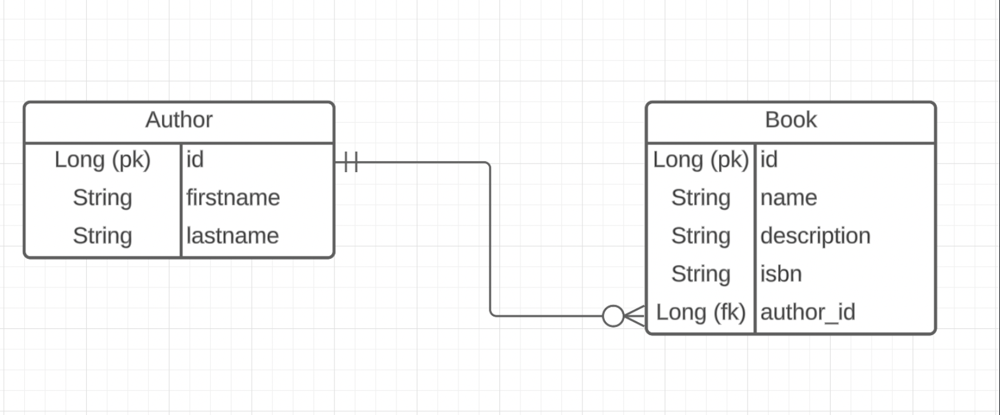

# My Book API
This an API that generates a database of books with their designated authors. This 
API was designed for a user to hold and store information about the books that
they possess along with their corresponding authors.Below is a list of the dependencies 
that you will need to run this application.

### Tools and Technology
[Spring Boot Rest API](https://start.spring.io/)

[Postman](https://www.postman.com/downloads/)

### Planning Documentation and Project Execution
Initially I took some time to plan out the scope of my project. I planned to have all the endpoints done in a few days
but that took some time. It took some time to figure out the mapping and to get the database and other things such
as the application properties set up. This took up the majority of the first day. The next day I coded all four
endpoints by adding the necessary code in the controller and services classes.

I decided to use the Cucumber framework for testing. However, I didn't fully understand it well and I found out soon
enough that I was testing my code improperly. This took up the majority of my Wednesday and I later received some
help from the instructors on how to properly use this framework. The remaining part of my work on this project was me
running into testing errors, and figuring out how to properly test my code, as well as refactoring it.
[My GitHub Project for the Books API](https://github.com/users/ObinnaUmerah/projects/5/views/1)

### User Stories
As a user, I should be able to create an author.

As a user, I should be able to get a single author from the database.

As a user, I should be able to update the author's information.

As a user, I should be able to delete a user from the database.

As a user, I should be able to create a book for a single author.

As a user, I should be able to get a book that belongs to a single author.

As a user, I should be able to update a book that belongs to a single author.

As a user, I should be able to delete a book that belongs to a single author.

### ERD Diagram
